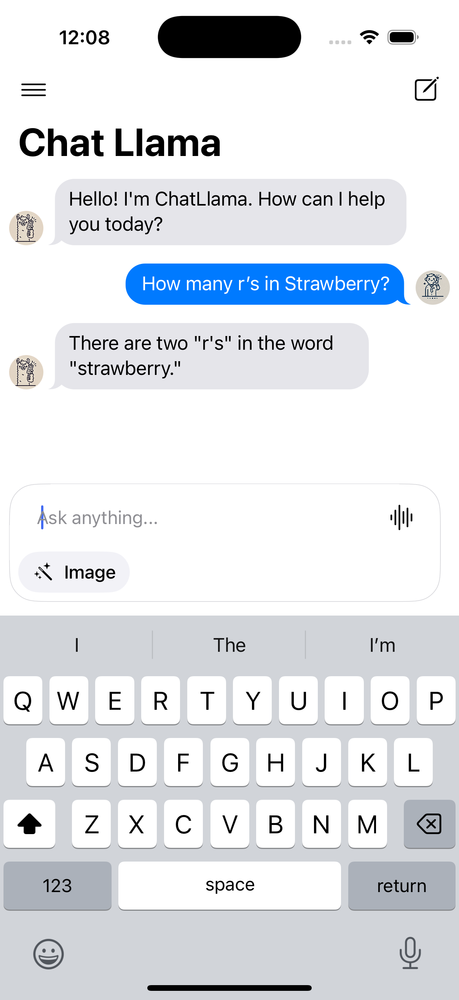
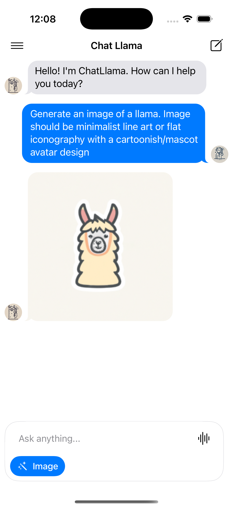

# ChatLlama

ChatLlama is a native iOS & Mac app that provides a modern chat interface for interacting with the Ollama and OpenAI models. The app supports both OpenAI's models and locally hosted Ollama models, featuring a clean and responsive chat interface built on top of MessageKit.

| Text Gen | Image Gen |
|---------|---------|
|  |  |

## Requirements
- iOS 18.2+
- Xcode 16.0+
- For Ollama: Mac running Ollama 
- For OpenAI: Valid API key

## Installation

1. Clone the repository:
```bash
git clone https://github.com/yourusername/ChatLlama.git
cd ChatLlama
```

2. Open the project in Xcode:
```bash
open ChatLlama.xcodeproj
```

3. Install dependencies using Swift Package Manager:
   - MessageKit (4.0.0+)
   - MacPaw/OpenAI 

4. Configure your LLM provider:
   - For OpenAI: Add your API key to Secrets.xcconfig
   - For Ollama: Follow the Ollama setup instructions below

5. Build and run the project (⌘+R)

## LLM Provider Setup

### OpenAI Setup

1. Create a Secrets.xcconfig file if it doesn't exist
2. Add your OpenAI API key:
```
OPENAI_API_KEY = your_api_key_here
```

### Ollama Setup

1. Install Ollama on your Mac by following the instructions at [Ollama's website](https://ollama.ai)

2. Run your desired model locally:
```bash
ollama run llama3.2:latest
```

## Configuration

The app uses a flexible configuration system through `LLMConfig.swift`:

- Choose between OpenAI and Ollama providers
- Configure model settings
- Set custom endpoints and API parameters

Default configurations:
- OpenAI: Uses GPT-4o Mini model
- Ollama: Connects to `http://localhost:11434` with Llama 3.2

## Architecture

ChatLlama follows an MVVM (Model-View-ViewModel) architectural pattern with clean separation of concerns:
- **Models**: Message and Sender types for chat data
- **Views**: UI components and ChatViewController for user interaction
- **ViewModels**: ChatViewModel containing business logic and state management
- **Configuration**: LLMConfig for LLM provider settings
- **Networking**: API services for provider communication

## License

This project is licensed under the MIT License - see the LICENSE file for details

## Acknowledgments

- [MessageKit](https://github.com/MessageKit/MessageKit) for the chat UI components
- [Ollama](https://ollama.ai) for the local LLM infrastructure 
- [MacPaw/OpenAI](https://github.com/MacPaw/OpenAI) for the OpenAI API client
